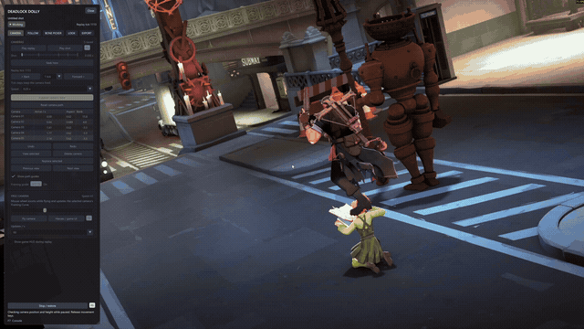

<div align="center">


# Deadlock Dolly

**A camera-path editor for local Deadlock replays.**

[](https://github.com/cravvnn/deadlock-dolly/releases)
[](https://github.com/sponsors/cravvnn)
[](https://discord.gg/PGVPEp4bT)
[](https://github.com/cravvnn/deadlock-dolly/issues)




</div>

Capture the free camera, shape a shot and play it back with animated framing and
camera variables.

**Current source: 0.6.35-alpha.** The portable Windows build opens through
`Dolly.exe`. Python and Tcl/Tk are bundled; no separate installation is needed.

**THIS MOD INJECTS CODE INTO DEADLOCK — USE AT YOUR OWN RISK.**

The Native driver loads a DLL into the game to apply camera movement during
each main rendered view. It runs in the game's user-mode process; there is no
kernel driver.

**KEEP `-insecure` IN DEADLOCK'S LAUNCH OPTIONS WHILE USING DOLLY.**

Dolly refuses to launch or connect unless it started the game process itself,
and it always adds `-dev -insecure -console` to that process. The launch-option
setting is a safety belt for the brief window before Dolly restores
`gameinfo.gi`: if Deadlock is started outside Dolly while a session is open,
exit that game before continuing. Close the editing session before launching
Deadlock normally.

## Contents

- [Features](#features)
- [Quick start](#quick-start)
- [Using the Windows app](#using-the-windows-app)
- [Application updates](#application-updates)
- [Video and ReShade](#video-and-reshade)
- [Recorded demos](#recorded-demos)
- [Compatibility](#compatibility)
- [Session files](#session-files)
- [Development](#development)
- [Support](#support)
- [License](#license)
- [Releases](#releases)

## Quick start

1. Download the **Windows x64** ZIP from [Releases](https://github.com/cravvnn/deadlock-dolly/releases) and extract it completely — keep `_internal` beside `Dolly.exe`.
2. Keep `-insecure` in Deadlock's launch options, open Steam and close any running Deadlock.
3. Run **Dolly.exe**, choose your game executable and a local `.dem` replay, then click **Open replay in Dolly**.
4. Move to a view and press **Ctrl+Alt+K** to capture it; **F8** opens the in-game panel.

See [Using the Windows app](#using-the-windows-app) for the full walkthrough.

## Features

### Editing and cameras

- In-game camera list: click to select, double-click to view, and delete the selected camera.
- Shared shot Undo/Redo in the desktop and in-game editors.
- Capture cameras from the game with configurable keyboard or mouse bindings.
- Smooth position paths, rotation and camera bank.
- Captured lens metadata preserved through replay reloads, playback, save/reopen and history.
- Numbered in-game camera guides and spline preview during paused editing.
- Replay playback with HUD handling, settings restoration and diagnostics.
- In-game playback speed and monitoring rate shared with desktop controls.
- Console fallback with Off, Light, Balanced and Strong smoothing choices.

### Native camera, Follow and Bone Picker

- Native camera playback evaluated for each main rendered view.
- Native paused-camera movement with WASD and mouse look.
- Game Follow with hero selection, adjustable distance/shoulder/height, slider resets and optional game HUD.
- Follow-camera (Player POV) export without the replay HUD: pick a hero with Game Follow and record or export while the HUD stays hidden.
- Bone-camera preview and attachment, including direct transfer from paused Follow.
- In-game panel for capture, saved views, replay controls and movement speed.
- Replay browser and automatic startup, with the unlocker initialized before the demo loads.

### Framing and depth of field

- Animated `r_aspectratio` framing with an editable desktop curve.
- Fourteen supported DOF controls synchronized with the native camera, including four-value range tracks.

### Recording and export

- Video recording at the game resolution: real-time or fixed-step, 30 to 600 FPS, hardware or software H.264/HEVC encoders, or lossless FFV1.
- Paired depth master as a 10-bit ProRes `.mov`, with an optional float EXR sequence and a normalized preview video.
- Isolated world, players and effects layer takes; players and effects get a real alpha channel from black and white matte passes.
- Optional game-only audio for real-time video, plus a separate advanced reconstructed-audio workflow.

### Stills and layers

- High-resolution screenshots: plate, 16-bit players-only matte, cut-out hero and depth from one paused view, up to 8192 × 8192 (see [High-resolution screenshots](docs/SCREENSHOTS.md)).

### ReShade and updates

- Optional ReShade color effects, its in-game menu on a configurable F11 key, and the verified scene depth published to ReShade for depth-based effects.
- Startup update check with manual checks in Settings.

## Using the Windows app

Download the **Windows x64** ZIP from [Releases](https://github.com/cravvnn/deadlock-dolly/releases).
Extract it completely and double-click **Dolly.exe**. Keep `_internal` beside
the EXE; a desktop shortcut can point to it.

Open Steam and close any running Deadlock. Dolly selects **DirectX 11** for
Native sessions without changing your saved graphics settings. In Dolly,
choose the game executable and a local `.dem` replay, or select a file from
**Library**. Click **Open replay in Dolly** to open the game, initialize the unlocker
in the hideout, load the replay and pause it for editing.

Move to a view and press **Ctrl+Alt+K** to capture it. **Replay timing** is the
default: advance the replay, frame the next view and capture again.
**F8** opens the in-game panel, **F7** opens the console, and
**F9** switches to Deadlock's replay UI for hero selection. Bindings, movement
speed and mouse sensitivity are saved from **Settings → Controls & keybinds**. Capture also works
while the replay is playing and leaves it paused.

Returning from hero selection to Dolly's native camera keeps the chosen view
and switches the underlying game camera to Free Cam. The native camera also
filters death desaturation and hides the game's player screen-particle layer
(including damage borders and low-health pulses) while it owns the view.
F9 restores the previous spectator mode and its effects; the separate
Player POV export keeps the game's selected-player view and effects.

In the F8 panel, use **Playback speed**, **Updates / s** and **Show path guides**.
Guides appear in paused flight and hide during playback. Native camera and
supported effects follow each rendered frame; Updates / s controls monitoring.

Enable the desktop **Full editor** switch for Cameras, Effects and the shot
timeline. The switch preserves the current shot and remembers the layout.
In-game, the tabs are **CAMERA, FOLLOW, BONE PICKER, LOOK and EXPORT**.

On **CAMERA**, one click selects a saved camera without moving the view;
double-click jumps to it. Delete removes only that camera. Undo/Redo restore
shot edits through the desktop or in-game controls. With the Dolly panel open,
use **Ctrl+Z** to undo and **Ctrl+Y / Ctrl+Shift+Z** to redo. These controls do
not rewind the replay or undo external game settings, and are guarded during
playback, recording and active pickers.

On **FOLLOW**, choose a hero to follow their aim with the game's camera.
Adjust distance, shoulder and height; right-click a slider to reset its normal
value. The HUD option lets you retain or hide the game UI. Follow is separate
from a bone attachment. You can open **BONE PICKER** directly from paused Follow.

Regular camera paths hold their final view when playback finishes. Explicit
**F9** or **F6 / Stop–restore** returns control through the spectator handoff.

On the desktop Effects tab, **+ Range DOF** creates a four-value range track.
Its value order is near blurry, near crisp, far crisp, far blurry. See the
[supported camera cvars](docs/SUPPORTED_CAMERA_CVARS.md) for values and examples.

In the in-game **LOOK** tab, right-click a DOF value to restore Dolly's default.
Enabling Citadel DOF switches off Native range DOF and supplies a usable aperture
when none is authored. Switching back retains your range settings and animation.

See `Start_Here.txt` and the [user guide](docs/USER_GUIDE.md) for the full controls.
The GitHub **Source code** download and source ZIP contain the source and build
files. Windows EXE build instructions are in [BUILDING.md](docs/BUILDING.md).

## Application updates

Starting with 0.5.6-alpha, opening Dolly.exe shows a startup update check against
the published GitHub Latest release and updates automatically when safe. The
updater is built into Dolly.exe; the editor runtime stays under _internal. Settings, shots and external tool
paths are preserved. Use Settings / Updates for manual checks or to turn off
automatic installation. See [Updating Dolly](docs/internal/UPDATING.md) for release
publishing and interrupted-update recovery.

## Video and ReShade

Choose an output path, FPS and encoder on **Export**, then use **F8 → Export → Record video**
and **Finish recording** in the game. Video capture excludes Dolly controls
and path guides. Real-time capture follows the game; fixed-step export advances
the simulation one frame at a time so the output stays deterministic. There is
optional game-only audio for real-time capture, and output resolution follows
the game. Fixed-step bundled audio is rejected; export silent layers separately.
Reconstructed audio is an advanced workflow with additional tools.
Recording continues through
camera handoffs and desktop controls; use Finish recording to save.

The **Depth master** option writes a paired depth `.mov` (and optional EXR
sequence) beside the color video. **World**, **Players** and **Effects** record
isolated layer takes; players and effects also get an alpha master built from
black and white matte passes. Depth and layer takes need a verified scene
sample for every frame and stop with an error instead of writing unpaired
data. Depth exports temporarily use 100% render scale for the color/depth take
and its selected extra passes, then restore the previous scale. This avoids
unverified depth from the game's spatial upscaling pass and can make exports
slower on GPUs that normally use reduced render scale. See [Layer export](docs/internal/LAYER_EXPORT.md) for details.

Select a compatible ReShade64.dll in **Settings → ReShade** to enable ReShade color effects.
**F11** opens its own menu; **Settings → Controls & keybinds** changes that shortcut. ReShade is an
optional separate download. Dolly bundles the crosire/prod80 shader library and
publishes its verified scene depth to ReShade, so depth-based effects such as
MXAO can use it. See [Video and ReShade](docs/VIDEO_AND_RESHADE.md) for setup
and limits.

## Recorded demos

Local tv_record .dem files can be selected like other replays. If a native shot
starts between recorded packets, Dolly starts at the next verified packet and
reports the skipped fraction. Camera/effect key times stay unchanged. Frozen
native preview holds the current scene without seeking. The scripted intro
remains visible during shot preparation until a true skip is verified. Some console position-
calibration recoveries still require exact ticks and can fail on sparse recordings.

Console camera preparation first checks the current view without seeking. It
uses a bounded refresh only when the measured camera response fails. If
**Stop / restore** leaves the health panel pending, the restore guide opens:
choose **Open replay controls**, select a hero and wait for its camera, then
return to Dolly and choose **Restore after selection**. The panel stays hidden
until that handoff is verified.

## Compatibility

Native mode supports reviewed builds of `client.dll`, `engine2.dll` and
`tier0.dll`. Every Dolly launch hashes the installed modules against the
bundled compatibility manifest (`native/profiles/manifest.json`) and reports an
unrecognized build instead of injecting. **Settings → Troubleshooting & recovery → Startup controls** has a
**Check game build** action, and **Console (legacy)** remains available when
Native is unavailable. See [game updates](docs/internal/GAME_UPDATES.md) for the
manifest, signature scanning and profile-generation workflow.
Console avoids the native camera/capture bridge, but its unlocker and automatic
startup-readiness checks still need support for the installed game build.

Native camera startup checks its essential view and gameplay-effect hooks
separately from the optional Follow correction. A rejected Follow correction
disables Game Follow while keeping a verified camera usable. Diagnostics record
which prerequisite failed; malformed optional diagnostic blocks no longer hide
the main camera status. Core protocol and process-identity checks remain strict.
This separation reduces the scope of some update failures; it does not approve
unknown game builds or establish support for Depth or Players output.

Current startup, Follow and attachment definitions share reviewed inputs across
Python and native code. One offline generator reproduces these definitions and
the camera/sound compatibility tables; native builds reject stale generated
data. The [maintainer workflow](docs/internal/GAME_UPDATES.md#shared-reviewed-contracts-unreleased-hardening)
records how to review and regenerate them after a game update.

0.6.0-alpha was checked against build 6726. Current-build checks covered camera
paths and mode transitions, camera-list/history controls, health/HUD restoration,
DOF with Confetti, short layer exports, and a three-second 180-frame Color/audio
take with zero missed slots and user-confirmed smooth, aligned playback.
These bounded checks do not certify every GPU, long take or 4K workload.

Floating health bars and the selected hero's health/ability HUD use separate
controls. Glow remains subject to the game's eligibility rules: enabling it
does not force every hero to glow, and its visual effect was not conclusively
verified. A reported particle checkerboard was not reproduced locally across
the tested presets and quality settings; do not assume every installation is fixed.

Real-time recording now retains rendered frames when replay time briefly repeats.
Genuine missed capture slots are still reported; high export FPS is not a promise
that the game or encoder can sustain that rate. See [validation notes](docs/internal/VALIDATION.md)
and [Video and ReShade](docs/VIDEO_AND_RESHADE.md) for workflow limits.

## Session files

Each editing launch creates a temporary `game/citadel_dolly_…` folder for its
plugins. The original `gameinfo.gi` is restored after unlocker initialization.
A read-only `gameinfo.gi` is supported and keeps its attribute. Uncompiled
Panorama files left in `game/citadel/panorama` are listed and refused before
launch, because development mode would load them before the packaged UI.
Deadlock's development build can show its own assertion dialogs; Dolly chooses
the ignore action for the game process it launched and records it in the
session, so a game-side failure cannot freeze editing.
The temporary folder is removed when the game exits. If Dolly closes first,
a background helper waits for that game process and then removes its files.
It exits afterward and does not start another game.

Older marked folders are checked on the next Dolly launch or through
**File → Recover game configuration** with Deadlock closed. Referenced mounts,
configuration conflicts and unrecognized files are left intact. Logs and
original configuration backups remain beside Dolly for diagnostics/recovery.

## Development

Run from source with Python 3.10+ and Tcl/Tk:

```console
python -m dolly
python -m unittest discover -s tests -q
```

The source editor needs no pip dependencies. Native features also require the
compiled Windows helper. EXE builds use the pinned dependencies in
`requirements-build.txt`, Python 3.12 x64, Visual Studio 2022 C++ tools and CMake.

| Location | Contents |
| --- | --- |
| `dolly/` | Desktop editor, settings and replay controller |
| `native/` | Native camera, input, DX11 panel, tests and dependencies |
| `assets/` | Logo and Windows icon |
| `tests/` | Regression tests |
| `packaging/`, `tools/` | Executable build and packaging |
| `examples/` | Example shot |
| `third_party/` | Bundled unlocker and component notices |
| `docs/` | User guide and build instructions (`docs/internal/` keeps maintainer research notes) |

Logs, replays, personal shots and build outputs are excluded from Git.
`SOURCE_FILES.txt` lists the source archive contents.

## Support

Contact **@Cravvnn on Discord** or [submit a GitHub issue](https://github.com/cravvnn/deadlock-dolly/issues)
if something is not working as intended. Include the Dolly version and the
ZIP from **Export diagnostics**. If the app does not open, include
`logs/Dolly_startup.log` and `logs/Dolly.log` when available.

## License

Dolly source uses the [MIT license](LICENSE.txt). Bundled components retain
their own notices under `third_party/` and `native/vendor/`. Artwork has
separate terms in [assets/README.md](assets/README.md).

## Releases

Recent releases and the complete history live in the [changelog](docs/CHANGELOG.md)
and the per-version [release notes](docs/).

- **0.6.35-alpha** — high-resolution screenshot assembly no longer leaves a stuck command window.
- **0.6.34-alpha** — Native Depth of Field works on installs that previously showed the black checkerboard.
- **0.6.33-alpha** — October 8 hotfix (6766) support, and a Players layer export that no longer leaves a stuck command window.
- **0.6.32-alpha** — the health/ability panel restores after editing.
